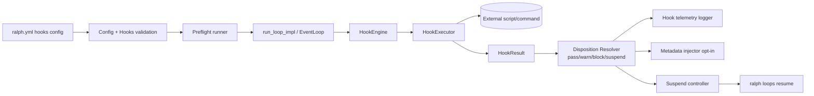
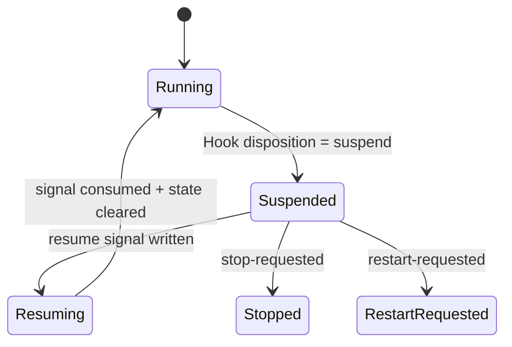
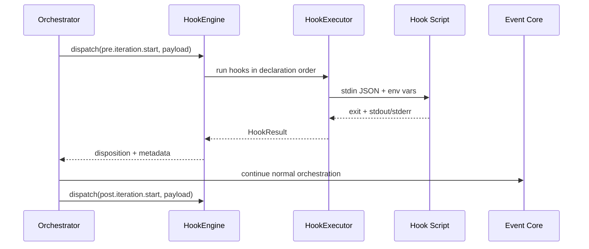

# Design: Per-Project Orchestrator Lifecycle Hooks for Ralph

## Overview

This design introduces a **per-project, YAML-configured hook system** for the Ralph orchestrator lifecycle.

The goal is to provide a foundational mechanism for:

- lifecycle observability,
- operational control (warn/block/suspend), and
- future extensibility,

while minimizing operator surprise and preserving Ralph’s current orchestration model.

### Scope of this design (v1)

- Per-project hooks only (configured in project `ralph.yml`)
- External command/script handlers
- Explicit `pre.<event>` / `post.<event>` hook phases
- Deterministic sequential execution
- Per-hook failure policy
- Suspend with operator resume (`ralph loops resume <id>`)
- JSON stdin payload contract
- Optional JSON metadata injection (explicit opt-in)
- Hook validation command + preflight integration

### Out of scope (v1 non-goals)

- Global hooks
- Parallel hook execution
- XML hook output
- Full prompt/event/config mutation

---

## Detailed Requirements

This section consolidates all clarified requirements.

### Functional requirements

1. Provide hook points across lifecycle phases that are useful for management and observability.
2. Hooks must be a foundational extension mechanism similar to hook systems in other agent harnesses.
3. v1 hook handlers run as external commands/scripts configured in YAML.
4. v1 scope is per-project only.
5. Hook failure behavior is configurable per hook.
6. Hooks can block or suspend orchestration.
7. Hook input contract is JSON on stdin, with minimal convenience env vars.
8. Mandatory v1 lifecycle events:
   - `loop.start`
   - `iteration.start`
   - `plan.created`
   - `human.interact`
   - `loop.complete`
   - `loop.error`
9. Every lifecycle event supports explicit `pre` and `post` phases.
10. Multiple hooks on one phase execute sequentially in declaration order.
11. v1 safeguards include `timeout_seconds` and `max_output_bytes`.
12. Persist per-hook telemetry: event/phase, start/end, duration, exit code, timeout flag, truncated stdout/stderr, disposition.
13. Suspend modes supported:
   - `wait_for_resume` (default)
   - `retry_backoff`
   - `wait_then_retry`
14. First operator resume surface is CLI: `ralph loops resume <id>`.
15. Context mutation is allowed only as explicit opt-in.
16. Initial mutation scope is JSON structured metadata injection only.
17. Metadata contract is JSON only.
18. Add `ralph hooks validate` and integrate it into preflight.
19. Success criteria: extensibility, easy config UX, strong testability.

### Design constraints

- Preserve current hat/event orchestration behavior.
- Avoid introducing orchestration-global complexity beyond v1 needs.
- Keep semantics explicit and inspectable.

---

## Architecture Overview

### High-level architecture



### Lifecycle insertion strategy

Hook dispatch is added at orchestrator boundaries that are stable today:

- loop startup
- iteration boundary
- iteration context boundary (selected hat/task context carried in payload)
- semantic plan event boundary
- human interaction boundary
- loop termination boundary

### Event-phase model

For each lifecycle event `E`, two hook phases exist:

- `pre.E`
- `post.E`

Examples:
- `pre.loop.start`, `post.loop.start`
- `pre.human.interact`, `post.human.interact`

---

## Components and Interfaces

### 1) Hooks configuration model

Add a top-level `hooks` section to `RalphConfig`.

```yaml
hooks:
  enabled: true
  defaults:
    timeout_seconds: 30
    max_output_bytes: 8192
    suspend_mode: wait_for_resume
  events:
    pre.loop.start:
      - name: env-guard
        command: ["./scripts/hooks/env-guard.sh"]
        on_error: block
    post.loop.complete:
      - name: notify
        command: ["./scripts/hooks/notify.sh"]
        on_error: warn
```

#### HookSpec fields (v1)

- `name` (required)
- `command` (required; argv form)
- `cwd` (optional)
- `env` (optional map)
- `timeout_seconds` (optional; fallback to defaults)
- `max_output_bytes` (optional; fallback to defaults)
- `on_error` (required: `warn | block | suspend`)
- `suspend_mode` (optional: `wait_for_resume | retry_backoff | wait_then_retry`)
- `mutate.enabled` (optional bool; default false)

### 2) HookEngine

Responsible for orchestration-phase dispatch.

Rust-level contract (conceptual):

```text
dispatch(phase_event, payload) -> HookPhaseOutcome
```

Where:
- `phase_event` is e.g. `pre.loop.start`
- payload is structured lifecycle context
- outcome aggregates per-hook outcomes + final disposition

### 3) HookExecutor

Runs one hook command with guardrails:

- pass payload JSON on stdin
- enforce `timeout_seconds`
- capture stdout/stderr
- truncate each stream to `max_output_bytes`
- return structured result

### 4) SuspendController

Handles suspend semantics and resume signaling.

Files in target loop workspace:

- `.ralph/suspend-state.json` (durable suspension state)
- `.ralph/resume-requested` (operator resume signal)

### 5) CLI surface: `ralph loops resume <id>`

Add a new loops subcommand that:

1. resolves loop via existing loop resolution logic,
2. verifies loop is suspended,
3. writes resume signal,
4. returns idempotent result messaging.

### 6) Hooks validation command

Add `ralph hooks validate` to verify:

- config shape + enum values,
- duplicate names/order sanity,
- event-phase keys validity,
- command executability/path checks,
- mutation contract settings.

Preflight integration: include hooks validation as a preflight check (respecting skip list behavior).

---

## Data Models

### A) Hook invocation stdin payload (JSON)

```json
{
  "schema_version": 1,
  "phase": "pre",
  "event": "loop.start",
  "phase_event": "pre.loop.start",
  "timestamp": "2026-02-28T15:30:00Z",
  "loop": {
    "id": "loop-1234-abcd",
    "is_primary": false,
    "workspace": "/repo/.worktrees/loop-1234-abcd",
    "repo_root": "/repo",
    "pid": 12345
  },
  "iteration": {
    "current": 7,
    "max": 100
  },
  "context": {
    "active_hat": "ralph",
    "selected_hat": "builder",
    "selected_task": null,
    "termination_reason": null,
    "human_interact": null
  },
  "metadata": {
    "accumulated": {}
  }
}
```

### B) Convenience env vars

- `RALPH_HOOK_EVENT` (e.g. `loop.start`)
- `RALPH_HOOK_PHASE` (`pre`/`post`)
- `RALPH_HOOK_PHASE_EVENT` (e.g. `pre.loop.start`)
- `RALPH_LOOP_ID`
- `RALPH_WORKSPACE`
- `RALPH_ITERATION`

### C) Hook stdout mutation payload (opt-in only)

Only parsed when `mutate.enabled: true`.

```json
{
  "metadata": {
    "risk_score": 0.72,
    "gates": ["policy_check", "ticket_linked"]
  }
}
```

Rules:
- Must be valid JSON object.
- Only `metadata` key accepted in v1.
- Metadata merged under a reserved namespace (e.g. `hook_metadata.<hook_name>`).

### D) Hook telemetry record

```json
{
  "timestamp": "2026-02-28T15:30:02Z",
  "loop_id": "loop-1234-abcd",
  "phase_event": "pre.loop.start",
  "hook_name": "env-guard",
  "started_at": "2026-02-28T15:30:01Z",
  "ended_at": "2026-02-28T15:30:02Z",
  "duration_ms": 923,
  "exit_code": 0,
  "timed_out": false,
  "stdout": "...truncated if needed...",
  "stderr": "",
  "disposition": "pass"
}
```

### E) Suspend state model

```json
{
  "schema_version": 1,
  "state": "suspended",
  "loop_id": "loop-1234-abcd",
  "phase_event": "pre.iteration.start",
  "hook_name": "manual-gate",
  "reason": "operator approval required",
  "suspend_mode": "wait_for_resume",
  "suspended_at": "2026-02-28T15:31:00Z"
}
```

### F) Suspend/resume state machine



---

## Event Mapping and Dispatch Details

### Mandatory event support in v1

#### `loop.start`
- `pre`: before loop initialization publishes start topic
- `post`: immediately after successful initialization

#### `iteration.start`
- `pre`: at iteration boundary before selection/execution
- `post`: after iteration context established (iteration number, selected hat/task context)
- note: v1 does not introduce dedicated `task.selected` or `hat.selected`; selected context is carried in this event payload.

#### `plan.created`
- semantic event derived from published topics matching `plan.*`
- supports both pre/post dispatch around plan event publication handling

#### `human.interact`
- `pre`: before question dispatch/wait path
- `post`: after response/timeout/failure outcome is known

#### `loop.complete` / `loop.error`
- derived from termination reason:
  - success => `loop.complete`
  - non-success => `loop.error`

### Lifecycle data flow



---

## Error Handling

### Hook execution errors

Handled per-hook using `on_error`:

- `warn`: log telemetry, continue
- `block`: fail current lifecycle action and surface clear reason
- `suspend`: enter suspend controller flow per `suspend_mode`

Error classes:
- non-zero exit
- timeout
- spawn failure
- invalid mutation JSON output (when mutation enabled)

### Suspend mode behavior

- `wait_for_resume` (default)
  - persist suspend state
  - wait until `.ralph/resume-requested` or stop/restart signal
- `retry_backoff`
  - retry hook with bounded backoff policy
- `wait_then_retry`
  - wait for resume then re-run hook once before continuing

### Signal precedence while suspended

To avoid ambiguous control:

1. `stop-requested`
2. `restart-requested`
3. `resume-requested`

### Idempotency guarantees

- Multiple `ralph loops resume <id>` calls are safe.
- Resume on non-suspended loops returns informative no-op.
- Resume signal consumption is atomic and single-use.

---

## Acceptance Criteria (Given-When-Then)

Each acceptance criterion below maps to a **Cucumber BDD scenario** in v1.

- Scenario IDs should be stable (`AC-01`, `AC-02`, ...).
- Feature files should live under `crates/ralph-e2e/features/hooks/`.
- CI should fail if any AC-mapped scenario fails.

1. **Per-project scope only** (`AC-01`)
   - Given a project with hooks configured
   - When Ralph runs in that project
   - Then hooks from that project config are loaded and no global hook source is required.

2. **Mandatory lifecycle events supported** (`AC-02`)
   - Given hooks for all required v1 events
   - When those lifecycle boundaries occur
   - Then corresponding hook phases are dispatched with structured payloads.

3. **Pre/post phase support** (`AC-03`)
   - Given `pre.E` and `post.E` hooks
   - When event `E` occurs
   - Then pre hooks run before and post hooks run after the lifecycle boundary.

4. **Deterministic ordering** (`AC-04`)
   - Given multiple hooks for a phase
   - When phase dispatch executes
   - Then hooks run sequentially in declaration order.

5. **JSON stdin contract** (`AC-05`)
   - Given a hook invocation
   - When the command starts
   - Then it receives a valid JSON payload on stdin and minimal env vars.

6. **Timeout safeguard** (`AC-06`)
   - Given `timeout_seconds` is configured
   - When hook execution exceeds timeout
   - Then execution is terminated and recorded as timed out.

7. **Output-size safeguard** (`AC-07`)
   - Given `max_output_bytes` is configured
   - When stdout/stderr exceed the limit
   - Then stored output is truncated deterministically.

8. **Per-hook warn policy** (`AC-08`)
   - Given `on_error: warn`
   - When the hook exits non-zero
   - Then orchestration continues and warning telemetry is recorded.

9. **Per-hook block policy** (`AC-09`)
   - Given `on_error: block`
   - When the hook fails
   - Then orchestration step is blocked and reason is surfaced.

10. **Suspend default mode** (`AC-10`)
   - Given `on_error: suspend` with no explicit mode
   - When hook fails
   - Then orchestrator suspends in `wait_for_resume` mode.

11. **CLI resume path** (`AC-11`)
   - Given a suspended loop
   - When operator runs `ralph loops resume <id>`
   - Then loop receives resume signal and continues from suspended boundary.

12. **Resume idempotency** (`AC-12`)
   - Given a loop already resumed or not suspended
   - When resume is requested again
   - Then command returns non-destructive informative result.

13. **Mutation opt-in only** (`AC-13`)
   - Given mutation is not enabled for a hook
   - When hook emits JSON metadata
   - Then metadata is ignored and orchestration context is unchanged.

14. **Metadata-only mutation surface** (`AC-14`)
   - Given mutation is enabled
   - When hook emits valid JSON metadata
   - Then only metadata namespace is updated; prompt/events/config remain immutable.

15. **JSON-only mutation format** (`AC-15`)
   - Given mutation output is non-JSON
   - When mutation parsing occurs
   - Then output is treated as invalid mutation output error.

16. **Hook telemetry completeness** (`AC-16`)
   - Given any hook invocation
   - When it completes (or times out)
   - Then telemetry includes event/phase, timestamps, duration, exit code, timeout, outputs, disposition.

17. **Validation command** (`AC-17`)
   - Given malformed hooks config
   - When `ralph hooks validate` runs
   - Then it returns actionable failures without starting loop execution.

18. **Preflight integration** (`AC-18`)
   - Given preflight is enabled
   - When `ralph run` starts
   - Then hooks validation executes as part of preflight and can fail the run.

---

## Testing Strategy

### BDD acceptance suite (Cucumber)

- Implement acceptance tests as Cucumber feature files under `crates/ralph-e2e/features/hooks/`.
- Add one scenario (or scenario outline) per acceptance criterion (`AC-01` ... `AC-18`).
- Keep a traceability table in test docs mapping `AC-*` to feature/scenario names.
- Implement step definitions in the e2e harness to drive real CLI flows (including `ralph loops resume <id>`).
- Gate CI on passing Cucumber acceptance scenarios for this feature.

### Unit tests

- Config parsing/validation:
  - valid/invalid event keys, enum values, required fields
- Hook executor:
  - timeout behavior
  - output truncation behavior
  - exit-code handling
- Mutation parser:
  - opt-in gating
  - JSON-only validation
  - metadata merge behavior
- Suspend controller:
  - state transitions and precedence rules
  - idempotent resume signal handling

### Integration tests

- `run_loop_impl` dispatches pre/post hooks at expected boundaries
- `on_error` behaviors (`warn`, `block`, `suspend`) alter control flow correctly
- `ralph loops resume <id>` targets correct loop and resumes suspended flow
- telemetry records emitted with required fields

### CLI tests

- `ralph hooks validate` human + JSON output modes
- preflight includes hooks check and supports skip behavior

### Replay/smoke tests

- Add fixture-based smoke tests under `crates/ralph-core/tests/fixtures/` for:
  - successful hook flows
  - blocked flow
  - suspend/resume flow

### E2E tests (mock-friendly)

- end-to-end suspend -> operator resume -> continuation path
- ensure no regressions in stop/restart/loop completion behavior

### Performance checks

- verify hook dispatch overhead is minimal when hooks disabled
- verify deterministic behavior under repeated resume/wait scenarios

---

## Appendices

### Appendix A: Technology choices

1. **External command hooks (chosen)**
   - Pros: flexible, language-agnostic, easy adoption
   - Cons: process execution overhead, command safety concerns

2. **JSON stdin contract (chosen)**
   - Pros: strict, versionable, machine-friendly
   - Cons: less hand-friendly than plain env vars

3. **Signal-file suspend/resume (chosen)**
   - Pros: aligns with existing Ralph stop/restart controls; inspectable and durable
   - Cons: requires careful race/atomic write handling

### Appendix B: Research findings integrated

- Current lifecycle boundaries are well-defined in `run_loop_impl` and `EventLoop`.
- EventBus observer and diagnostics patterns reduce implementation risk for telemetry.
- Human interaction path already validates blocking/wait semantics.
- External systems consistently favor explicit phases, deterministic ordering, durable pause state, and idempotent resume.

### Appendix C: Alternative approaches considered

1. **In-process plugin hooks**
   - Rejected for v1 due to complexity and safety blast radius.

2. **Parallel hook execution**
   - Rejected for v1 due to ordering surprises and harder debugging.

3. **Global hook scope in v1**
   - Rejected per requirement; deferred as future feature.

4. **XML mutation contract**
   - Rejected in v1; JSON-only for consistency and parser simplicity.

### Appendix D: Known v1 limitations

- No global hook layering/override model.
- No parallel hook execution.
- No full orchestration mutation surfaces.
- Semantic `plan.created` depends on plan-topic publication patterns.

