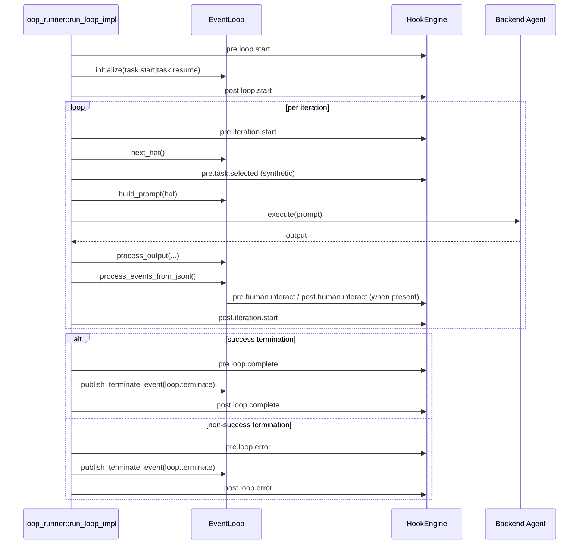

# Research: Ralph Orchestrator Lifecycle Map

## Goal
Map concrete orchestrator lifecycle boundaries and identify stable hook insertion points for a per-project hook system.

## Key Findings

### 1) The runtime lifecycle is concentrated in `run_loop_impl`
Primary control flow is in `crates/ralph-cli/src/loop_runner.rs`:

- Loop startup entry: `run_loop_impl` (`:64`)
- Initialize event loop entry event (`task.start` or `task.resume`): `:179-181`
- Main loop begins: `:776`
- Per-iteration termination guard: `event_loop.check_termination()` (`:886`)
- Hat selection: `event_loop.next_hat()` (`:911`)
- Prompt construction: `event_loop.build_prompt(&hat_id)` (`:1073`)
- Model execution + output handling
- Output processing: `event_loop.process_output(...)` (`:1342`)
- JSONL event ingestion: `event_loop.process_events_from_jsonl()` (`:1380`)
- Completion signal handling: `event_loop.check_completion_event()` (`:1396`)
- Termination event publication: `event_loop.publish_terminate_event(...)` (`:794`, `:888`, `:929`, `:964`, etc.)

### 2) Existing lifecycle observability exists, but is split
- Diagnostics orchestration stream supports:
  - `iteration_started`, `hat_selected`, `event_published`, `backpressure_triggered`, `loop_terminated`, `task_abandoned`
  - Source: `crates/ralph-core/src/diagnostics/orchestration.rs:16-22`
- Event bus observer infrastructure is already in place:
  - `EventBus::add_observer` and observer callback on every `publish`
  - Source: `crates/ralph-proto/src/event_bus.rs:42`, `:79`
- There is already an event-history logger path in loop-runner (`log_events_from_output`), but this logs parsed output events for observability and does **not** drive orchestration routing.
  - Source: `crates/ralph-cli/src/loop_runner.rs:1736`

### 3) Human interaction is already a true blocking lifecycle phase
`human.interact` is detected during JSONL event ingestion and can block until response/timeout:

- Detects `human.interact` in validated events
- Sends question through robot service
- Blocks on `wait_for_response`
- Injects `human.response`

Source: `crates/ralph-core/src/event_loop/mod.rs:1962-2089`

This is a strong precedent for hook-driven suspend/wait behavior.

### 4) Current lifecycle signals do not directly match requested v1 hook events
Requested mandatory v1 events: `loop.start`, `iteration.start`, `task.selected`, `plan.created`, `human.interact`, `loop.complete`, `loop.error` (excluding backpressure).

Current state:

- `loop.start`: implicit in startup flow; no dedicated orchestrator event topic.
- `iteration.start`: partially represented (RPC iteration_start in CLI loop; diagnostics emits iteration_started in `process_output`).
- `task.selected`: no canonical orchestrator event.
- `plan.created`: no canonical orchestrator event.
- `human.interact`: explicit and already handled.
- `loop.complete` / `loop.error`: currently represented as `loop.terminate` + reason (`TerminationReason`).

Source anchors:
- `check_completion_event` + completion reason: `event_loop/mod.rs:495+`
- terminate publication: `event_loop/mod.rs:2115+`

## Candidate Hook Event Taxonomy (v1)

Given current code boundaries and your requirements, the least-surprising event taxonomy for v1 is:

- `pre.loop.start` / `post.loop.start`
- `pre.iteration.start` / `post.iteration.start`
- `pre.task.selected` / `post.task.selected` (synthetic orchestrator event)
- `pre.plan.created` / `post.plan.created` (synthetic orchestrator event)
- `pre.human.interact` / `post.human.interact`
- `pre.loop.complete` / `post.loop.complete`
- `pre.loop.error` / `post.loop.error`

Where `loop.complete`/`loop.error` are derived from `TerminationReason::is_success()` and reason mapping.

## Proposed insertion map (high-level)

## Design Implications

1. We can implement hooks without changing hat/event semantics by instrumenting the orchestrator boundary in `run_loop_impl` and selected points in `EventLoop`.
2. Two requested events (`task.selected`, `plan.created`) require explicit synthesized orchestrator signals to become stable primitives.
3. Existing observer + diagnostics infrastructure reduces implementation risk for telemetry and testability.

## Internal Sources

- `crates/ralph-cli/src/loop_runner.rs` (especially `:64`, `:179-181`, `:776`, `:886`, `:911`, `:1073`, `:1342`, `:1380`, `:1396`)
- `crates/ralph-core/src/event_loop/mod.rs` (`check_termination`, `check_completion_event`, `process_events_from_jsonl`, `publish_terminate_event`)
- `crates/ralph-proto/src/event_bus.rs` (`add_observer`, `publish`)
- `crates/ralph-core/src/diagnostics/orchestration.rs`
