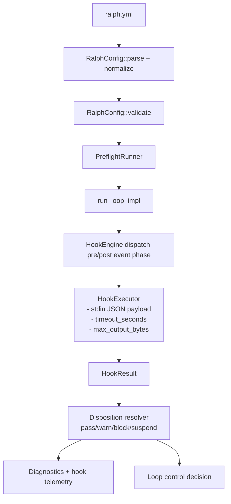

# Research: Config + Hook Execution Model Fit

## Goal
Determine how a per-project hook system should fit Ralph’s current config, validation, and execution architecture.

## Key Findings

### 1) Config architecture already supports adding a top-level extensibility section
`RalphConfig` is the main schema object and already hosts optional subsystems (`memories`, `tasks`, `skills`, `features`, `RObot`).

- `RalphConfig`: `crates/ralph-core/src/config.rs:19`
- Validation entrypoint: `RalphConfig::validate`: `:366`

This is the natural place to add a new top-level per-project `hooks:` block.

### 2) Validation and preflight pipelines are established and reusable
There are two clear validation stages:

1. **Config semantic validation** (`config.validate()`)
2. **Preflight checks** (`PreflightRunner`), optionally auto-run before `ralph run`

Sources:
- `PreflightRunner` + default checks: `crates/ralph-core/src/preflight.rs:99`, `:104`
- CLI preflight command wrapper: `crates/ralph-cli/src/preflight.rs:41+`
- Auto-preflight in run flow: `crates/ralph-cli/src/main.rs:1167+`

Implication: your requested `ralph hooks validate` can be implemented cleanly and then reused by preflight as an additional check.

### 3) Existing command execution is distributed; hooks need a dedicated runner
Ralph currently executes commands in multiple contexts (CLI command handlers, adapter executors, git ops, bot/service helpers). There is no single generic external-command abstraction with hook-specific semantics.

For hooks, we need a dedicated `HookExecutor` with:

- timeout enforcement (`timeout_seconds`)
- output capture truncation (`max_output_bytes`)
- stdin JSON payload contract
- structured result (exit code, timed_out, stdout/stderr truncated)

This aligns with your v1 safety requirements and observability requirements.

### 4) Observer infrastructure can support telemetry, but not policy alone
`EventBus` observers (`add_observer`) are ideal for passive audit/telemetry.

Source: `crates/ralph-proto/src/event_bus.rs:42`, `:79`

But observers are not enough for policy gates (block/suspend/mutate metadata), which require explicit orchestrator-level hook dispatch before/after specific lifecycle operations.

### 5) Current diagnostics schema can absorb hook-run telemetry with minimal shape drift
Diagnostics already writes structured JSONL and tracks orchestration events.

Sources:
- `DiagnosticsCollector`: `crates/ralph-core/src/diagnostics/mod.rs:34`
- `OrchestrationEvent` variants: `crates/ralph-core/src/diagnostics/orchestration.rs:16-22`

Implication: add hook-specific diagnostic entries (or extend orchestration event enum) to persist:
- event/phase
- start/end
- duration
- exit code
- timeout flag
- truncated stdout/stderr
- disposition (pass/warn/block/suspend)

## Recommended v1 config shape (draft)

```yaml
hooks:
  enabled: true
  events:
    pre.loop.start:
      - name: env-guard
        command: ["./scripts/hook-env-guard.sh"]
        timeout_seconds: 30
        max_output_bytes: 8192
        on_error: warn   # warn | block | suspend
        suspend_mode: wait_for_resume  # wait_for_resume | retry_backoff | wait_then_retry
        mutate:
          enabled: false
    post.loop.complete:
      - name: notify
        command: ["./scripts/hook-notify.sh"]
        timeout_seconds: 10
        max_output_bytes: 4096
        on_error: warn
```

Notes consistent with your requirements:
- per-project only
- sequential declaration order
- per-hook failure policy
- optional blocking/suspend
- JSON stdin payload primary contract
- metadata mutation opt-in only

## Suggested architecture



## Open Design Edges (to resolve in design phase)

1. Precise config precedence if hooks are later added globally (future feature).
2. Exact JSON schema versioning strategy (`schema_version` field strongly recommended).
3. How metadata mutation merges into prompt context (safe namespace and collision policy).

## Internal Sources

- `crates/ralph-core/src/config.rs`
- `crates/ralph-core/src/preflight.rs`
- `crates/ralph-cli/src/preflight.rs`
- `crates/ralph-cli/src/main.rs` (`run_auto_preflight`)
- `crates/ralph-proto/src/event_bus.rs`
- `crates/ralph-core/src/diagnostics/mod.rs`
- `crates/ralph-core/src/diagnostics/orchestration.rs`
