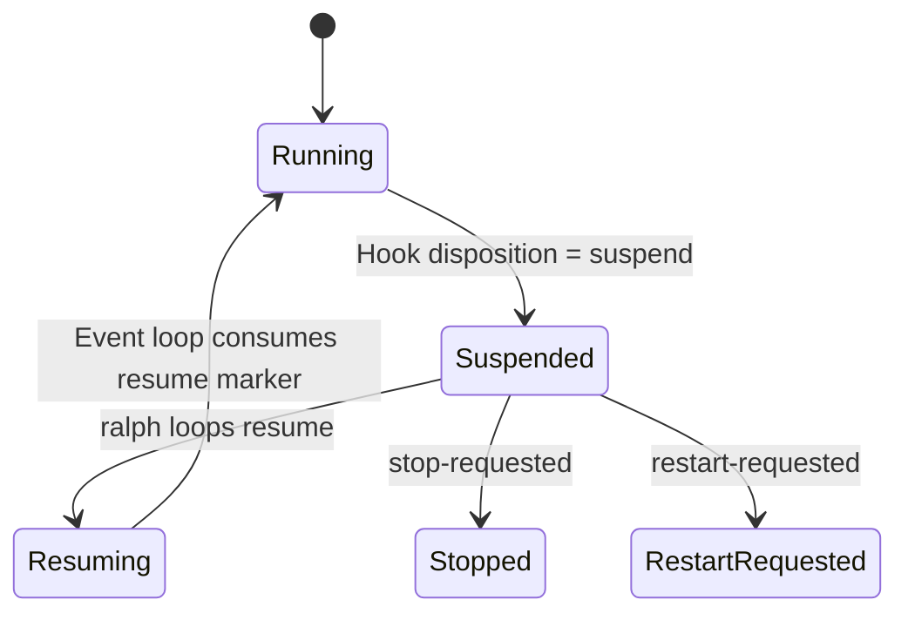

# Research: Operator Resume Surface (`ralph loops resume <id>`)

## Goal
Find the least-surprising architecture path for adding operator resume in v1, aligned with existing Ralph lifecycle controls.

## Key Findings

### 1) There is already an operator control pattern: filesystem signal files
Current controls already use file signals checked at iteration boundaries:

- `ralph loops stop` writes `.ralph/stop-requested` in the target loop workspace.
  - `crates/ralph-cli/src/loops.rs:727`, `:836`
- Event loop reads these signals in `check_termination()`.
  - stop: `.ralph/stop-requested` (`crates/ralph-core/src/event_loop/mod.rs:469-474`)
  - restart: `.ralph/restart-requested` (`:479-481`)
- `/stop` and `/restart` Telegram commands write the same signal files.
  - `crates/ralph-telegram/src/commands.rs:343-377`

This is already an established multi-surface control-plane pattern (CLI + Telegram → same signal contract).

### 2) `loops` command namespace is the right place for resume UX
`loops` already contains operational controls and loop targeting:

- command enum + dispatch: `crates/ralph-cli/src/loops.rs:37`, `:166-186`
- stop subcommand + args: `:54`, `:123`, `:727`
- loop resolution helper (`resolve_loop`) already supports full/partial IDs and worktree/main lookup.
  - `:1147`

`ralph loops resume <id>` can mirror the `stop` path with minimal surprise.

### 3) Restart already has full lifecycle handling beyond the signal file
When event loop returns `TerminationReason::RestartRequested`, CLI removes restart marker and exec-replaces process.

- `crates/ralph-cli/src/main.rs:1631-1643`

This is useful precedent: a simple signal in core, richer control behavior in CLI orchestration layer.

### 4) There is no current suspended state model
There is no existing “suspended/paused” state in:

- `LoopRegistry` metadata (id/pid/start/prompt/worktree/workspace only)
- `loops list` status vocabulary (`running`, `queued`, `merging`, `needs-review`, `merged`, `discarded`, `crashed`, `orphan`)

So `resume` requires introducing a durable suspended-state marker contract.

## Recommended v1 state model

Use an explicit, file-backed suspension contract (same family as stop/restart):

- `.ralph/suspend-state.json` (authoritative suspension context)
- `.ralph/resume-requested` (operator release signal)

Suggested `suspend-state.json` shape:

```json
{
  "schema_version": 1,
  "loop_id": "loop-1234",
  "state": "suspended",
  "suspended_at": "2026-02-28T15:00:00Z",
  "source": "hook",
  "hook": {
    "name": "policy-gate",
    "event": "pre.task.selected",
    "reason": "awaiting operator approval"
  },
  "suspend_mode": "wait_for_resume"
}
```

Why this fits:
- durable across process restarts/crashes,
- easy to inspect/debug,
- consistent with existing signal-file approach,
- no new daemon/service dependency.

## Recommended `loops resume` behavior (v1)

`ralph loops resume <id>` should:

1. Resolve loop/workspace via existing `resolve_loop`.
2. Verify loop is running and currently suspended (`suspend-state.json` exists + state=suspended).
3. Write `.ralph/resume-requested` atomically.
4. Return a clear idempotent message.

Idempotency rules:
- If already resumed / not suspended: return success with informative no-op message.
- If loop not found or dead: return actionable error.

## Race and safety considerations

To minimize surprises:

- **Atomic writes**: write temp file + rename for marker/state updates.
- **CAS-style transition**: only allow `suspended -> resuming -> running` transitions.
- **Double resume tolerance**: second resume is no-op (not error).
- **Conflict with stop/restart**: define precedence (recommended: stop/restart > resume).

## Lifecycle control sketch



## Design implications for your requirements

- Supports your requested operator surface directly: `ralph loops resume <id>`.
- Compatible with suspend defaults (`wait_for_resume`) while still allowing future hybrid modes.
- Keeps behavior explicit and inspectable (important for observability and testability).

## Internal Sources

- `crates/ralph-cli/src/loops.rs`
- `crates/ralph-core/src/event_loop/mod.rs`
- `crates/ralph-cli/src/main.rs`
- `crates/ralph-telegram/src/commands.rs`
