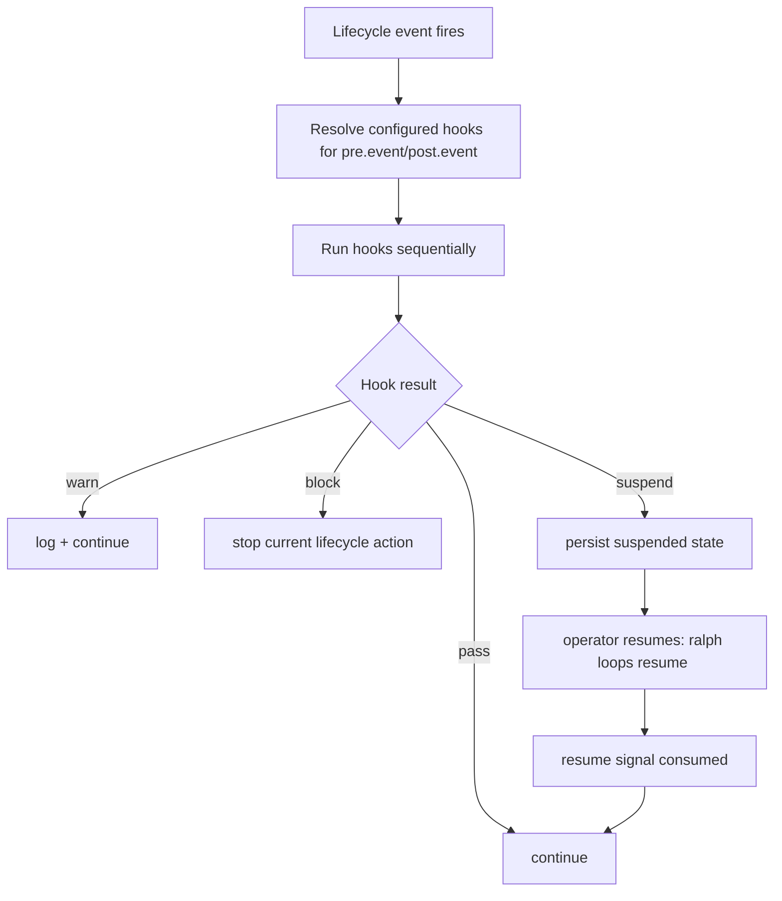

# Research: External Hook + Pause/Resume Patterns

## Goal
Extract proven patterns from Claude Code hooks and CI/orchestration systems to reduce operator surprise in Ralph v1 hooks.

## Snapshot
Research verified against publicly available docs as of 2026-02-28.

## Findings

### 1) Explicit lifecycle phases reduce ambiguity
Across systems, users understand hooks best when phases are explicit (`pre`/`post`) and semantically scoped.

- Git hooks use named lifecycle boundaries (`pre-commit`, `post-commit` etc.).
- Claude Code exposes explicit hook events and pre/post semantics around tool and stop flows.

**Implication for Ralph:** your chosen `pre.<event>` and `post.<event>` model is the right default for low surprise.

### 2) Blocking behavior must be explicit and narrow
Good systems clearly separate:

- blocking gates (can prevent progress), and
- observational hooks (cannot block).

Claude Code docs explicitly distinguish hook decisions and stop behavior; CI systems similarly separate manual gates from post-job notifications.

**Implication for Ralph:** keep per-hook `on_error` + `suspend_mode` explicit, and avoid hidden global behavior.

### 3) Deterministic ordering is preferred by operators
Systems that minimize surprise default to deterministic execution order.

- CI/docs patterns consistently emphasize explicit stage/dependency ordering.
- Parallelism is usually opt-in and guarded.

**Implication for Ralph:** your v1 choice (sequential declaration order) matches broad operator expectations.

### 4) Durable pause/suspend state beats in-memory pause flags
Robust orchestrators persist suspended state in control-plane state (resource spec/DB/object state), not just process memory.

- Argo supports suspend/resume with persisted workflow state and CLI resume.
- Prefect and similar systems enforce paused-state preconditions before resume.

**Implication for Ralph:** persist suspension state on disk (`.ralph/...`) and make resume idempotent.

### 5) Resume actions should be idempotent and policy-aware
Reliable systems use:

- state precondition checks,
- idempotent retry/no-op behavior,
- clear authorization and audit context.

- GitLab play/retry/manual controls and deployment approvals separate decision from execution.
- GitHub deployment approval APIs formalize pending→approved/rejected flows.
- Jenkins `input` step provides explicit human proceed/abort gate semantics.

**Implication for Ralph:** `ralph loops resume <id>` should check state and produce no-op success when already resumed.

### 6) Config UX patterns that reduce surprises
Recurring best practices:

- explicit modes over booleans,
- visible precedence rules,
- dry-run/validate commands,
- clear timeouts.

**Implication for Ralph:**
- keep mutation opt-in and explicit,
- provide `ralph hooks validate` pre-run,
- make timeout/output-limit first-class fields (you already chose this).

## Practical pattern mapping for Ralph v1

## Anti-surprise guardrails to carry into design

1. **Default deterministic execution** (already chosen).
2. **Explicit per-hook failure/suspend policy** (already chosen).
3. **JSON-only contracts with schema versioning** (aligned with your decision).
4. **Idempotent resume with clear user messaging**.
5. **Durable suspension markers with inspectable files**.
6. **Validation command integrated into preflight** (already requested).

## Sources

### Hook systems
- Claude Code Hooks: https://code.claude.com/docs/en/hooks
- Claude Docs Hooks: https://docs.claude.com/en/docs/claude-code/hooks

### Git / CI lifecycle patterns
- Git hooks: https://git-scm.com/docs/githooks.html
- GitHub workflow syntax: https://docs.github.com/en/actions/reference/workflows-and-actions/workflow-syntax
- GitHub concurrency controls: https://docs.github.com/en/actions/how-tos/write-workflows/choose-when-workflows-run/control-workflow-concurrency
- GitHub reruns: https://docs.github.com/en/actions/how-tos/manage-workflow-runs/re-run-workflows-and-jobs

### Manual approval / pause-resume surfaces
- GitHub deployments & environments: https://docs.github.com/en/actions/reference/workflows-and-actions/deployments-and-environments
- GitHub review deployments: https://docs.github.com/en/actions/how-tos/deploy/configure-and-manage-deployments/review-deployments
- GitHub workflow-runs REST: https://docs.github.com/en/rest/actions/workflow-runs
- GitLab job control: https://docs.gitlab.com/ci/jobs/job_control/
- GitLab CI YAML: https://docs.gitlab.com/ci/yaml/
- GitLab jobs API: https://docs.gitlab.com/api/jobs/
- GitLab deployment approvals: https://docs.gitlab.com/ci/environments/deployment_approvals/
- GitLab deployments API: https://docs.gitlab.com/api/deployments/
- Jenkins pipeline input step: https://www.jenkins.io/doc/pipeline/steps/pipeline-input-step/

### Orchestrator suspend/resume patterns
- Argo suspend walkthrough: https://argo-workflows.readthedocs.io/en/latest/walk-through/suspending/
- Argo resume CLI: https://argo-workflows.readthedocs.io/en/latest/cli/argo_resume/
- Argo async pattern: https://argo-workflows.readthedocs.io/en/release-3.4/async-pattern/
- Airflow DAG concepts: https://airflow.apache.org/docs/apache-airflow/stable/core-concepts/dags.html
- Airflow deferring: https://airflow.apache.org/docs/apache-airflow/stable/authoring-and-scheduling/deferring.html
- Prefect flow runs reference: https://reference.prefect.io/prefect/flow_runs/
- Prefect interactive controls: https://docs.prefect.io/v3/advanced/interactive
