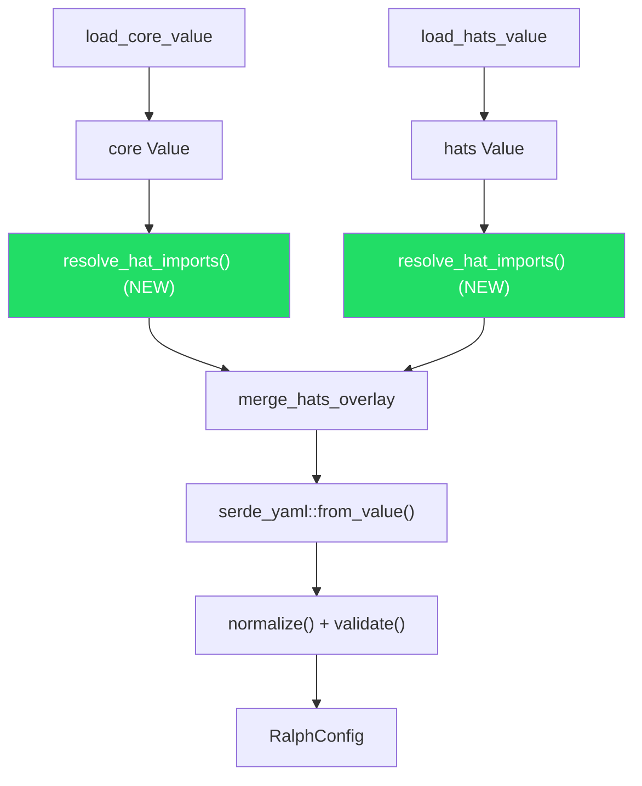

# Design: Hat Imports — Reusable Hat Definitions via Local File Import

## Overview

Hat imports allow preset authors to define a hat once in a standalone YAML file and reference it from any preset, with optional field-level overrides. This eliminates duplication across presets and enables a shared hat ecosystem.

**Phase 1 scope:** Local file imports only. No URL imports, no transitive imports. Simple, predictable, and delivers the core value.

## Detailed Requirements

### Functional Requirements

1. **Import syntax**: A hat definition in a preset can include an `import:` key pointing to a local file path (relative to the importing file, or absolute).

2. **Imported hat file format**: A standalone YAML file containing a single hat definition — the same fields as `HatConfig` (`name`, `description`, `triggers`, `publishes`, `instructions`, `extra_instructions`, `backend`, `backend_args`, `default_publishes`, `max_activations`, `disallowed_tools`).

3. **Override semantics**: Any field specified alongside `import:` in the consuming preset **fully replaces** the corresponding field from the imported file. Fields not specified locally are inherited from the imported file. No deep merging — field-level replacement only.

4. **No `events:` in imported files**: Imported hat files are pure hat definitions. Event metadata belongs in the consuming preset's top-level `events:` section.

5. **No transitive imports**: An imported hat file cannot itself contain an `import:` key. If one is found, it is rejected with a clear error.

6. **All HatConfig fields are overridable**: No restrictions on which fields can be overridden by the consuming preset.

### Source Compatibility

| Config source | Supports `import:`? | Path resolution base |
|---------------|---------------------|---------------------|
| `-c ./ralph.yml` (file) | Yes | Directory containing the file |
| `-H ./hats.yml` (file) | Yes | Directory containing the file |
| `-H builtin:feature` (embedded) | No — rejected with clear error | N/A |
| `-H https://...` (remote) | No — Phase 2 | N/A |

### Error Handling

- Errors include both the importing file and imported file (stack-trace style)
- File not found, invalid YAML, invalid hat schema, and transitive import rejection all produce distinct, actionable error messages
- No import-specific validation warnings — existing validation handles structural issues post-resolution

### Non-Requirements (Phase 2+)

- URL imports (requires lockfile, caching, domain allowlist, content validation)
- Transitive imports (requires cycle detection)
- Import-aware validation warnings
- Shared hat directory conventions

## Architecture Overview



Import resolution happens at the `serde_yaml::Value` level, between YAML parsing and serde deserialization. Each config source resolves its own imports independently before the overlay merge.

## Components and Interfaces

### 1. Import Resolution Function

**Location**: `crates/ralph-cli/src/preflight.rs` (new function)

```rust
/// Resolves `import:` keys in a hats mapping.
///
/// `hats` is the mapping of hat-id → hat-definition (i.e. the contents of
/// the `hats:` key, not the full config Value). The caller is responsible
/// for extracting the hats mapping from whatever config shape it loaded
/// (full config via `-c` or hats overlay via `-H`).
///
/// For each hat that contains an `import:` key:
/// 1. Resolves the path (relative to `base_dir`, or absolute as-is)
/// 2. Reads and parses the referenced file as YAML
/// 3. Validates it contains no `import:` key (no transitive imports)
/// 4. Validates it contains no `events:` key (not allowed in hat files)
/// 5. Uses the imported fields as a base, overlays local fields on top
/// 6. Removes the `import:` key from the result
///
/// Returns the modified mapping with all imports resolved.
fn resolve_hat_imports(hats: &mut Mapping, base_dir: &Path, source_label: &str) -> Result<()>
```

**Parameters**:
- `hats`: Mutable reference to the hats mapping (hat-id → hat-definition). The caller extracts this from the parsed Value — from the `hats:` key for `-c` configs, or from the root for `-H` overlays.
- `base_dir`: Directory of the file being loaded (for resolving relative paths)
- `source_label`: Human-readable label for error messages (e.g., the file path)

### 2. Hat Field Merge Function

**Location**: `crates/ralph-cli/src/preflight.rs` (new function)

```rust
/// Merges an imported hat definition with local overrides.
///
/// The imported hat provides base values. Any field present in `local_overrides`
/// replaces the corresponding field from `imported`. The `import:` key is
/// removed from the result.
fn merge_imported_hat(imported: Mapping, local_overrides: &Mapping) -> Mapping
```

**Semantics**: For each key in `local_overrides` (except `import:`), insert it into the imported mapping, replacing any existing value. This is field-level replacement, not deep merge.

### 3. Integration into Load Pipeline

**Modified functions in `preflight.rs`**:

- `load_config_for_preflight()`: After loading core value and before merge, extract the `hats:` mapping from the core value and call `resolve_hat_imports()`. After loading hats value and before merge, extract the root mapping (which is already the hats mapping for `-H` overlays) and call `resolve_hat_imports()`. Each caller knows its own Value shape and passes the uniform hats mapping to the resolution function.

- For `HatsSource::Builtin`: Before calling `resolve_hat_imports()`, check if the hats section contains any `import:` keys. If so, reject with error: "Hat imports are not supported in embedded presets. Use a file-based preset instead."

### 4. Imported Hat File Schema

A standalone hat file is a flat YAML mapping with `HatConfig` fields:

```yaml
# shared-hats/builder.yml
name: "Builder"
description: "TDD builder — one task, one commit"
triggers: ["build.task"]
publishes: ["build.done", "build.blocked"]
default_publishes: "build.done"
max_activations: 5
instructions: |
  ## BUILDER MODE
  You are the Builder. Implement one task at a time using TDD.
  ...
```

**Validation rules for imported files**:
- Must be a YAML mapping (not a sequence or scalar)
- Must NOT contain an `import:` key (no transitive imports)
- Must NOT contain an `events:` key (event metadata belongs in consuming preset)
- No required fields — the `name` requirement applies to the *resolved* hat (after merge), not the imported file itself. This allows importing a "template" hat and supplying `name` in the consuming preset.
- Unknown fields are silently ignored (consistent with existing `HatConfig` behavior)

## Data Models

No new Rust types are needed. The imported file is parsed into a `serde_yaml::Value`, validated for disallowed keys, and merged with local overrides at the Value level. The result is a standard hat entry in the YAML tree that serde deserializes into `HatConfig` as usual. Error formatting uses local variables — no dedicated struct.

## Error Handling

### Error Cases

| Error | Message Pattern |
|-------|----------------|
| Import file not found | `failed to resolve hat import\n  --> {source}, hat '{id}'\n  --> imports {path}\n\n  cause: file not found` |
| Import file is invalid YAML | `failed to resolve hat import\n  --> {source}, hat '{id}'\n  --> imports {path}\n\n  cause: {yaml_error}` |
| Transitive import detected | `failed to resolve hat import\n  --> {source}, hat '{id}'\n  --> imports {path}\n\n  cause: imported hat files cannot contain 'import:' directives (transitive imports are not supported)` |
| Events in imported file | `failed to resolve hat import\n  --> {source}, hat '{id}'\n  --> imports {path}\n\n  cause: imported hat files cannot contain 'events:' — event metadata belongs in the consuming preset` |
| Import in embedded preset | `hat imports are not supported in embedded presets — '{hat_id}' contains an 'import:' directive.\n\nhint: use a file-based preset to use hat imports` |
| Import path is not a string | `failed to resolve hat import\n  --> {source}, hat '{id}'\n\n  cause: 'import' must be a string file path` |

### Error Propagation

All import errors are fatal — they cause `load_config_for_preflight()` to return `Err`. No partial resolution: if any import fails, the entire config load fails.

## Acceptance Criteria

### Basic Import Resolution

```
Given a preset file with a hat that has `import: ./shared/builder.yml`
And `./shared/builder.yml` exists with valid hat fields
When the preset is loaded
Then the hat definition includes all fields from the imported file
And the `import:` key is not present in the resolved config
```

### Field-Level Override

```
Given a preset file with a hat that has `import: ./shared/builder.yml` and `max_activations: 3`
And the imported file has `max_activations: 5`
When the preset is loaded
Then the hat's `max_activations` is 3 (local override wins)
And all other fields come from the imported file
```

### Override Replaces, Does Not Merge

```
Given a preset file with a hat that has `import: ./shared/builder.yml` and `publishes: ["build.done"]`
And the imported file has `publishes: ["build.done", "build.blocked"]`
When the preset is loaded
Then the hat's `publishes` is `["build.done"]` (full replacement, not merge)
```

### No Transitive Imports

```
Given a preset with `import: ./shared/builder.yml`
And `./shared/builder.yml` contains an `import:` key
When the preset is loaded
Then loading fails with error: "imported hat files cannot contain 'import:' directives"
```

### No Events in Imported Files

```
Given a preset with `import: ./shared/builder.yml`
And `./shared/builder.yml` contains an `events:` key
When the preset is loaded
Then loading fails with error: "imported hat files cannot contain 'events:'"
```

### Embedded Preset Rejection

```
Given an embedded preset (loaded via `-H builtin:name`)
And the preset contains a hat with an `import:` key
When the preset is loaded
Then loading fails with error: "hat imports are not supported in embedded presets"
```

### Import File Not Found

```
Given a preset with `import: ./nonexistent.yml`
When the preset is loaded
Then loading fails with an error identifying both the preset file and the missing import path
```

### Relative Path Resolution

```
Given `presets/my-workflow.yml` with `import: ../shared-hats/builder.yml`
And `shared-hats/builder.yml` exists
When `presets/my-workflow.yml` is loaded
Then the import resolves to `shared-hats/builder.yml` (relative to the importing file)
```

### Absolute Path Import

```
Given a preset file with a hat that has `import: /absolute/path/to/builder.yml`
And `/absolute/path/to/builder.yml` exists with valid hat fields
When the preset is loaded
Then the import resolves using the absolute path directly (no base_dir join)
And the hat definition includes all fields from the imported file
```

### Import Without `name` (Supplied by Override)

```
Given a preset file with a hat that has `import: ./shared/template.yml` and `name: "My Builder"`
And the imported file does NOT contain a `name` field
When the preset is loaded
Then the resolved hat has `name: "My Builder"` from the local override
And validation passes (name requirement is on the resolved hat, not the imported file)
```

### Multiple Hats with Imports

```
Given a preset with two hats, each importing from different files
When the preset is loaded
Then both imports are resolved independently
And the resolved config contains both hats with their imported fields
```

### Mixed Inline and Imported Hats

```
Given a preset with one imported hat and one fully inline hat
When the preset is loaded
Then both hats are present in the resolved config
And the inline hat is unaffected by import resolution
```

### Split Config with Imports

```
Given `-c ralph.yml` with hats containing `import:` directives
And `-H custom-hats.yml` with hats containing `import:` directives
When the config is loaded
Then imports in `-c` resolve relative to `ralph.yml`'s directory
And imports in `-H` resolve relative to `custom-hats.yml`'s directory
And the `-H` hats replace `-c` hats as usual (after import resolution)
```

## Testing Strategy

### Unit Tests (in preflight.rs or a new test module)

1. **resolve_hat_imports()** with a Value containing import keys — verify fields are merged
2. **merge_imported_hat()** — verify field-level replacement semantics
3. **Override precedence** — local field replaces imported field
4. **No-op for hats without import** — hats without `import:` pass through unchanged
5. **Transitive import rejection** — imported file with `import:` key causes error
6. **Events rejection** — imported file with `events:` key causes error
7. **File not found** — missing import file produces descriptive error
8. **Invalid YAML** — broken import file produces error with both file paths
9. **Import path not a string** — `import: 42` produces clear error
10. **Multiple imports in one preset** — each resolved independently
11. **Absolute path import** — `import: /abs/path.yml` resolves without joining `base_dir`
12. **Imported file without `name`** — no error when consuming preset supplies `name` override

### Integration Tests (in crates/ralph-cli/tests/)

1. **End-to-end import via CLI** — write preset + hat files to TempDir, run `ralph preflight` or `ralph run --dry-run`, verify resolved config
2. **Embedded preset with import rejected** — `ralph run -H builtin:feature` with import in a modified builtin (or test via the function directly)
3. **Split config imports** — `-c` and `-H` both with imports, verify independent resolution
4. **Error messages** — verify error output includes both source file and import path

### Manual Smoke Test

Create `presets/hats/builder.yml` and a preset that imports it. Run `ralph preflight --check config` to verify resolution.

## Appendices

### A. Technology Choices

- **No new dependencies**: Import resolution uses `std::fs::read_to_string` and `serde_yaml` (both already in use)
- **No new data structures**: Works entirely with `serde_yaml::Value` / `Mapping` types
- **No changes to HatConfig**: The `import:` key is consumed at the Value level; `HatConfig` deserialization is unchanged

### B. Research Findings

See `research/` directory for detailed findings on:
- **Config loading pipeline** — insertion point identified at Value level in `preflight.rs`
- **YAML import patterns** — surveyed 6 tools; field-level replacement is simplest and most predictable
- **Embedded preset constraints** — no filesystem context; imports must be disallowed
- **URL import security** — deferred to Phase 2; local imports avoid all supply chain risks
- **Circular import detection** — unnecessary when transitive imports are disallowed
- **Serde unknown fields** — `HatConfig` silently ignores unknown fields, confirming Value-level processing is required
- **Merge overlay mechanics** — import resolution slots cleanly before `merge_hats_overlay()`
- **Test patterns** — unit tests in `config.rs`, integration tests with TempDir + Command

### C. Alternative Approaches Considered

1. **Add `import` field to HatConfig struct**: Rejected because serde would need custom deserialization, and the field is a loading concern, not a runtime concern. Processing at the Value level keeps HatConfig clean.

2. **Deep merge instead of field replacement**: Rejected for complexity and unpredictability. Every tool surveyed that uses deep merge has edge cases around list handling. Field replacement is simple and explicit.

3. **Allow events in imported files**: Rejected because event metadata is a preset-level concern (how hats relate to each other), not a single-hat concern. Only 1 of 16 presets uses `events:` at all. Keeps imported files simple and side-effect-free.

4. **URL imports in Phase 1**: Rejected due to security complexity. Imported hat files contain AI agent instructions with tool access — the attack surface includes prompt injection. Local imports deliver the core value without supply chain risk.

5. **Transitive imports in Phase 1**: Rejected for simplicity. Disallowing transitive imports eliminates circular import risk entirely. The primary use case (shared hat files referenced from presets) doesn't need multi-level composition.

### D. Phase 2 Roadmap (Future)

When demand warrants:
- **URL imports** with lockfile (`.ralph/imports.lock`), content-addressable cache, domain allowlist, vendor directory, `--frozen-imports` for CI
- **Transitive imports** with stack-based cycle detection and depth limit of 5
- **`events:` in imported files** scoped to the hat's declared `publishes` events
